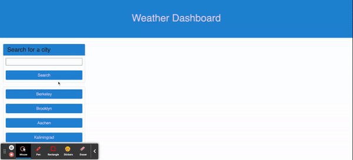

# Openweather-Api-Dashboard
6th assignment of UCB Extension bootcamp

[Link to the deployed page](https://liubovsobolevskaya.github.io/Openweather-Api-Dashboard/)
_______________________________________
For this assessment we implent a weather website where you can type in a city name, the website will show you the current weather and forecast for that city. It will also keep a history of the cities you've searched for. When you look at the current weather for a city, you'll see the name of the city, the date, and information about the temperature, humidity, and wind speed. When you look at the forecast for a city, you'll see a prediction for the next 5 days, including information about the temperature, wind speed, and humidity. If you want to look at the weather for a city you've already searched for, you can click on it in the search history and it will show you the same information again.

___________________________

## Technology Used 

* [HTML](https://developer.mozilla.org/en-US/docs/Web/HTML)
* [CSS](https://developer.mozilla.org/en-US/docs/Web/CSS)      
* [Git](https://git-scm.com/)   
* [JavaScript](https://www.javascript.com/)   
* [Google Fonts](https://fonts.googleapis.com/) 
* [jQuery](https://jquery.com/)
* [ajax](https://api.jquery.com/jquery.ajax/)

## Web application's appearance and functionality

## Author Info

### Liubov Sobolevkaya
* [LinkedIn](https://www.linkedin.com/in/liubov-sobolevskaya-45756a101/)
* [Github](https://github.com/LiubovSobolevskaya)
* [Kaggle](https://www.kaggle.com/lyubovsobolevskaya)